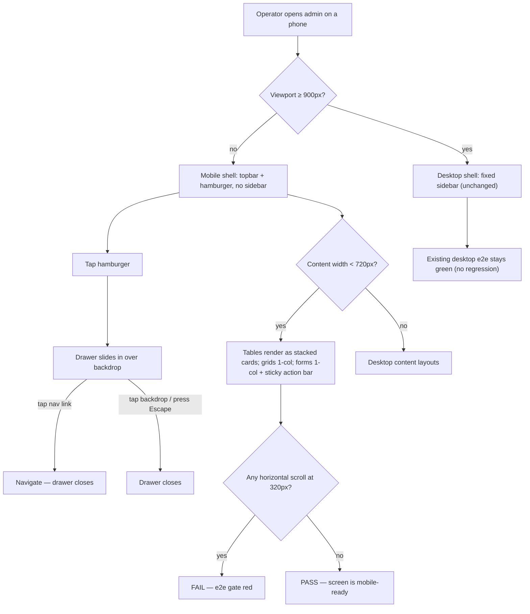

# Admin mobile responsive v1 — epic design (ENG-242)

**Repo:** stablepass-admin · **Base branch:** `feature/admin-responsive-v1` · FE-only, no migrations.
Slices: ENG-243 (shell, `shared-surface`) → ENG-244 dashboard · ENG-245 posts · ENG-246 compose ·
ENG-247 horses · ENG-248 trainers (parallel) → ENG-249 [Gate] → one human PR to `main`.

## Why
The admin is desktop-only (zero `@media` in the mockup design system; one 1080px breakpoint in the
app). The operator/client uses phones — full mobile parity down to 320px.

## Locked decisions (the mobile design — no mobile mockup exists)
1. Full parity: sign-in, dashboard, compose, posts, horses (list/add/edit), trainers (list/add/edit
   + contacts). OUT: race entry (ENG-180, unbuilt), member web, new features.
2. Build against the desktop mockups (`../dev-handover/StablePass-mockups/mockups/web/admin/screens/`
   + `mockups/web/style.css` — the `.rx/mockups.md` path is stale, see gotchas) + these rules.
3. Breakpoints: shell → hamburger **drawer < 900px**; content stacking (tables→cards, grids→1-col,
   forms→1-col) **< 720px**; compose's 1080px collapse stays. Floor **320px**; e2e at 320×700 + 375×812.
4. Nav: topbar hamburger → slide-in drawer (backdrop/Escape close, closes on navigation), state in
   `AdminNav` (already client).
5. Tables → stacked cards < 720px (posts library, trainer contacts).
6. Compose: preview rail stacks below the form; PreviewModal frames stack vertically (Mobile first).
7. Sticky bottom action bar on mobile for Compose + all add/edit forms (`env(safe-area-inset-bottom)`).
8. Tap targets ≥ 44px. **No horizontal scroll at 320px on any route** — machine-checked
   (`scrollWidth <= innerWidth` in each screen's Playwright spec).

## Feature flow

## API & data flow
Pure presentation — no endpoint, contract, or data change. All admin BFF contracts, the 403
guardrail suites, and the direct-upload media flow stay byte-identical.

## Collision map
Only ENG-243 touches the shared hot files (`app/globals.css`, `app/(dash)/layout.tsx`,
`AdminNav.tsx`) — labelled `shared-surface`. Every screen slice owns exactly its own directory plus
its own e2e spec; screens port shared CSS into their scoped stylesheet rather than editing
`globals.css` (repo gotcha). `e2e/screenshots.spec.ts` belongs to the gate (ENG-249) alone.
