# StablePass — Flows

Two levels: one **big-picture journey** across the whole product, then a **detailed flow per action** with the API endpoint annotated on each step. Detailed-flow names line up with the big-picture stages. A **flow → API mapping** table follows at the end.

Legend: `[PostgREST]` = direct data call under RLS · `/api/…` = custom endpoint · **404** for hidden content, **402** when the subscription gate fails.

---

## 0. Big-picture user flow (whole journey)

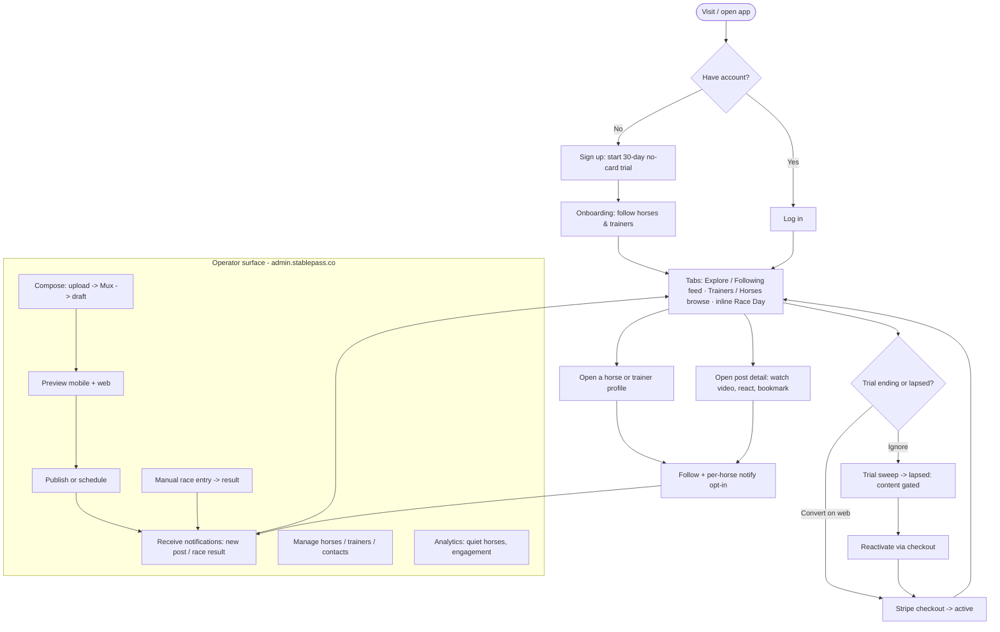

---

## 0b. Big-picture admin flow *(operator journey — `admin.stablepass.co`)*

The whole operator journey across the admin dashboard. Each detailed admin flow (sign-in, compose, race entry, manage, crons) is one stage here. Everything is gated by `is_admin`.

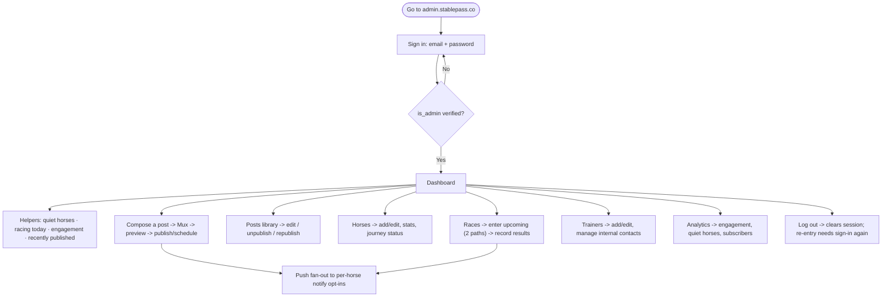

The detailed admin flows are **9** (compose → publish), **10** (race entry), **11** (manage horses/trainers/contacts), **12** (system crons), and **13** (sign-in) below.

---

## 1. Sign-up → Trial start *(web)*

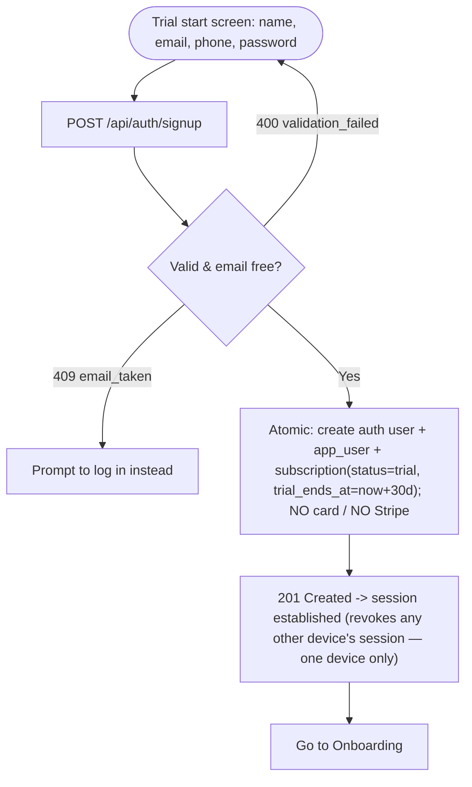

## 2. Social login → bootstrap *(Apple / Google / Facebook)*

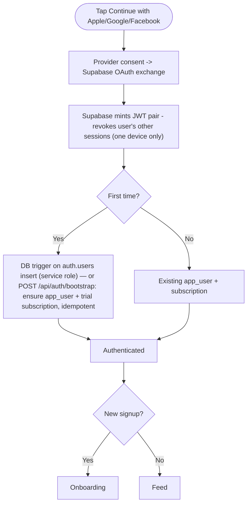

> App Store rule: because Google/Facebook are offered, **Sign in with Apple is mandatory on iOS**.

## 3. Onboarding — follow horses & trainers

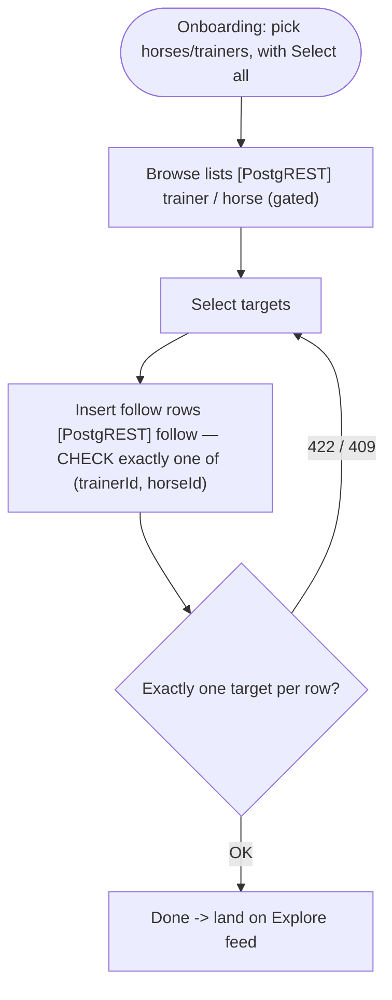

## 4. Feed & browse *(top tabs: Explore · Trainers · Horses · Following)*

The top tab bar has four tabs. **Explore** and **Following** are the two *ranked feed* views; **Trainers** and **Horses** are *browse* lists. **Race Day** is not a tab — it's an inline "today's racing" band woven into the Explore/Following feed (per the mockup).

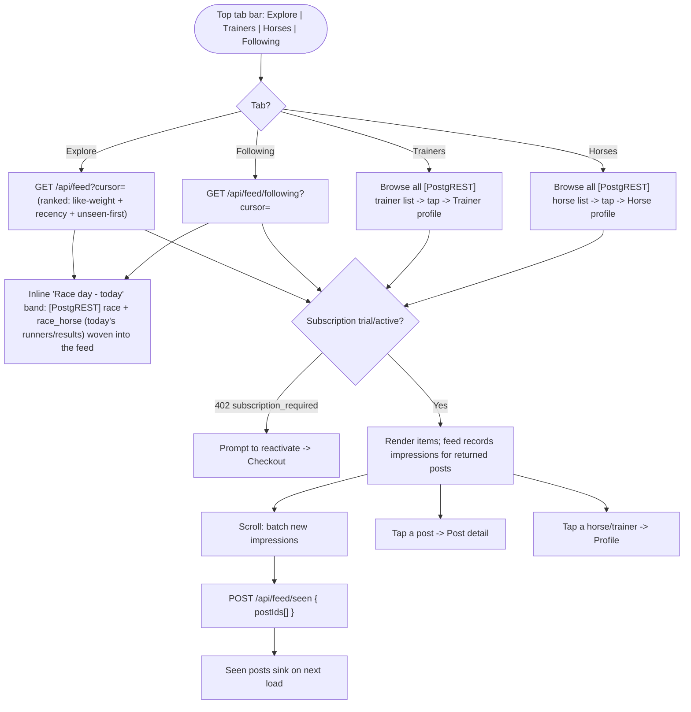

## 5. Post detail — watch, react, bookmark

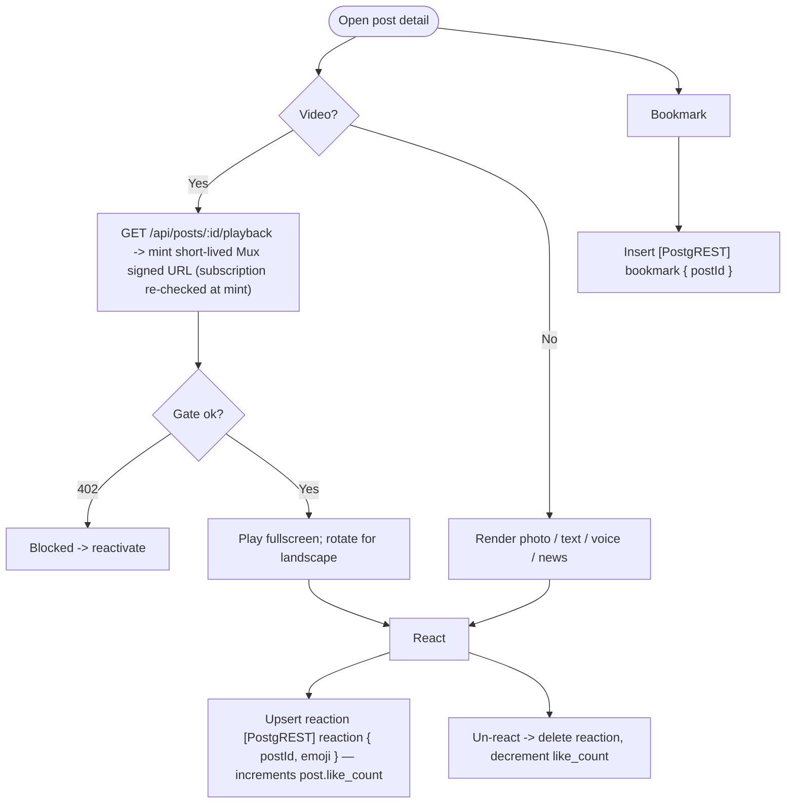

## 6. Follow & per-horse notify opt-in

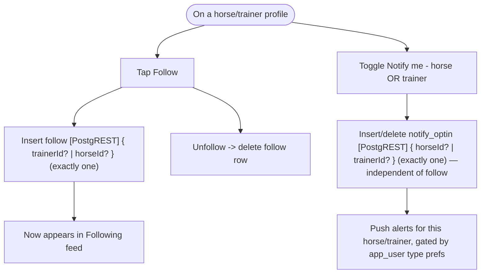

## 7. Subscription checkout → conversion *(web only)*

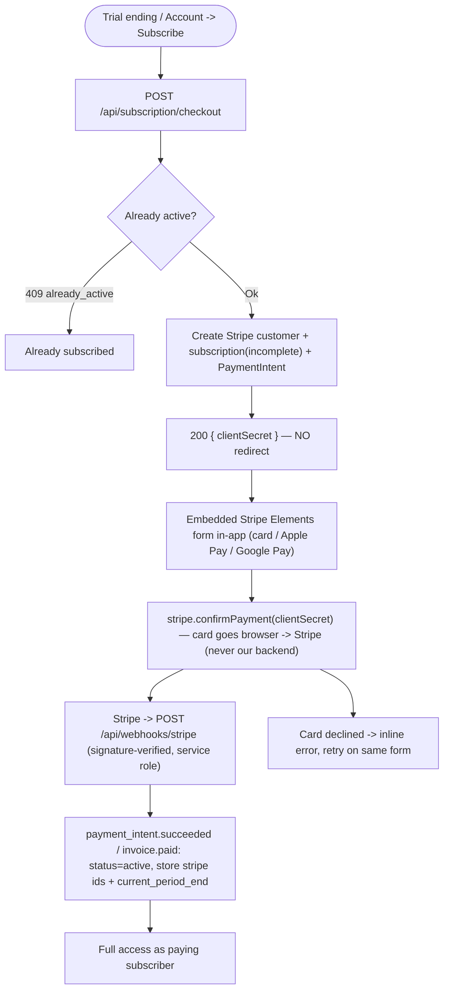

## 8. Notifications — receive & read

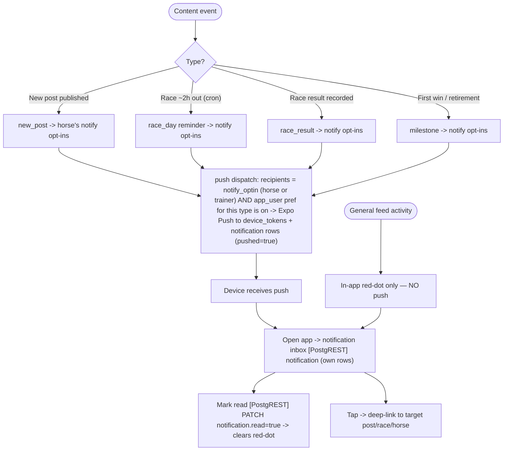

## 9. Admin — compose → publish / schedule

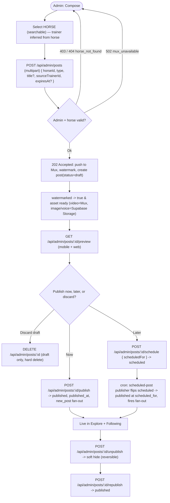

## 10. Admin — race entry (two paths) → result

Normalised `race` **event** + `race_horse` **runner**, so the admin can enter a race **from a horse** or **from a race**. Both converge on the same `race_horse` row.

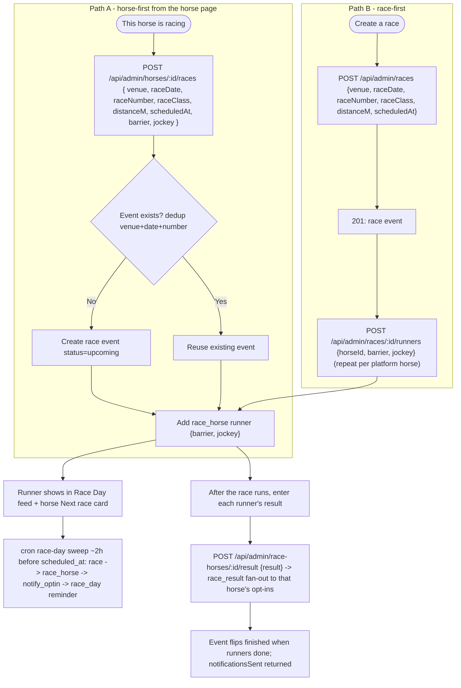

## 11. Admin — manage horses, trainers & contacts

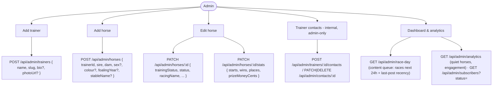

## 12. System — scheduled jobs *(cron, service role)*

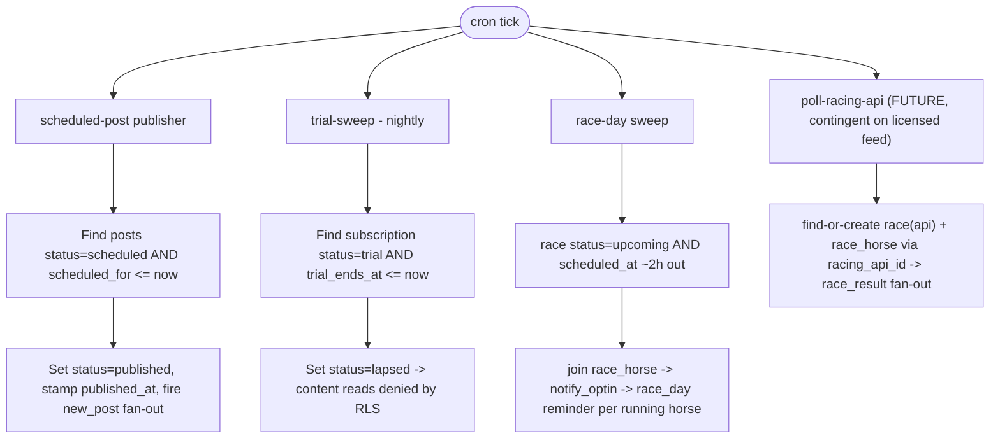

## 13. Admin — sign in

The gate to all admin flows (9–12). Handled by **Supabase Auth** (not a custom endpoint). The `is_admin` flag is what separates the operator from a subscriber; the admin surface lives at `admin.stablepass.co`.

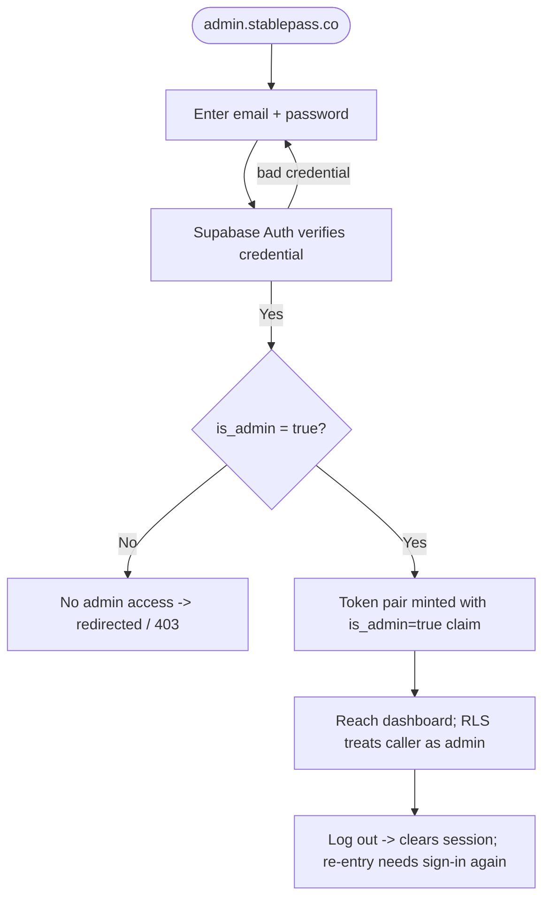

Notes: the admin is a normal `app_user` row with `is_admin = true` — there is no separate admin identity. Login/logout/refresh are all Supabase Auth via the SDK, and every admin sign-in attempt is audited. **2FA (TOTP) is deferred** — not in this version; it can be layered on the admin login later without touching the data model.

---

## Flow → API mapping

| Flow | Step | Method · Endpoint | Data touched |
|---|---|---|---|
| 1 Sign-up | Create trial account | `POST /api/auth/signup` | `app_user`, `subscription(trial)` |
| 2 Social login | First-login bootstrap | `POST /api/auth/bootstrap` *(or DB trigger)* | `app_user`, `subscription(trial)` |
| — | Profile + gate summary | `GET /api/me` | `app_user`, `subscription`, prefs |
| — | Edit profile + notif prefs | `PATCH /api/me` | `app_user` (name, phone, pref_*) |
| 3 Onboarding | Browse lists | `[PostgREST] GET trainer` / `horse` | `trainer`, `horse` |
| 3 Onboarding | Follow selected | `[PostgREST] INSERT follow` | `follow` |
| 4 Feed | Explore tab | `GET /api/feed` | `post`, `horse`, `trainer`, `impression`, `reaction`(reacted), `bookmark` |
| 4 Feed | Following tab | `GET /api/feed/following` | `post`, `follow` |
| 4 Feed | Trainers / Horses tabs (browse) | `[PostgREST] GET trainer` / `horse` list | `trainer`, `horse` |
| 4 Feed | Race Day (inline band) | `[PostgREST] race + race_horse` + race-result `post` | `race`, `race_horse`, `post` |
| 4 Feed | Record impressions | `POST /api/feed/seen` | `impression` |
| 5 Post detail | Video playback URL | `GET /api/posts/:id/playback` | `post`, `subscription` (re-gate), Mux |
| 5 Post detail | React / un-react | `[PostgREST] upsert/delete reaction` | `reaction`, `post.like_count` |
| 5 Post detail | Bookmark | `[PostgREST] insert/delete bookmark` | `bookmark` |
| 6 Follow/notify | Follow / unfollow | `[PostgREST] follow` | `follow` |
| 6 Follow/notify | Notify opt-in (horse or trainer) | `[PostgREST] notify_optin` | `notify_optin` |
| 7 Checkout | Create checkout | `POST /api/subscription/checkout` | `subscription`, Stripe |
| 7 Checkout | Conversion webhook | `POST /api/webhooks/stripe` | `subscription(active)` |
| 7 Checkout | Confirm payment (embedded) | `stripe.confirmPayment(clientSecret)` (client-side) | Stripe (card never hits backend) |
| 7 Checkout | Cancel (no hosted portal) | `POST /api/subscription/cancel` | `subscription(canceled)` |
| 8 Notifications | Read inbox | `[PostgREST] notification` | `notification` |
| 8 Notifications | Mark read | `[PostgREST] PATCH notification` | `notification.read` |
| 8 Notifications | Register device | `[PostgREST] device_token` | `device_token` |
| 9 Admin content | Upload → draft | `POST /api/admin/posts` | `post(draft)`, Mux |
| 9 Admin content | Preview | `GET /api/admin/posts/:id/preview` | `post` |
| 9 Admin content | Review queue / library / search | `GET /api/admin/posts?status=&q=` | `post` |
| 9 Admin content | Discard draft | `DELETE /api/admin/posts/:id` (draft only) | `post` (hard delete) |
| 9 Admin content | Edit | `PATCH /api/admin/posts/:id` | `post` |
| 9 Admin content | Publish | `POST /api/admin/posts/:id/publish` | `post(published)`, `notification` fan-out |
| 9 Admin content | Schedule | `POST /api/admin/posts/:id/schedule` | `post(scheduled)` |
| 9 Admin content | Unpublish / republish | `POST …/unpublish` · `…/republish` | `post(unpublished/published)` |
| 10 Admin race | Race-first: create event | `POST /api/admin/races` | `race(upcoming)` |
| 10 Admin race | Race-first: attach runner | `POST /api/admin/races/:id/runners` | `race_horse` |
| 10 Admin race | Horse-first: find-or-create + attach | `POST /api/admin/horses/:id/races` | `race`, `race_horse` |
| 10 Admin race | Record runner result | `POST /api/admin/race-horses/:id/result` | `race_horse(result)`, `notification` fan-out |
| 10 Admin race | Edit / delete | `PATCH`/`DELETE /api/admin/races/:id` · `/race-horses/:id` | `race`, `race_horse` |
| 11 Admin manage | New trainer / horse | `POST /api/admin/trainers` · `/api/admin/horses` | `trainer`, `horse` |
| 11 Admin manage | Edit horse / stats | `PATCH /api/admin/horses/:id` · `…/stats` | `horse` |
| 11 Admin manage | Trainer contacts | `POST /api/admin/trainers/:id/contacts` · `PATCH`/`DELETE /api/admin/contacts/:id` | `trainer_contact` |
| 11 Admin manage | Dashboard content queue | `GET /api/admin/race-day` | `race` + `race_horse` + `horse` + last-`post` recency |
| 11 Admin manage | Analytics / subscribers | `GET /api/admin/analytics` · `/api/admin/subscribers` | aggregate reads |
| 12 System | Scheduled publish | *cron* scheduled-post publisher | `post(scheduled→published)`, `notification` |
| 12 System | Trial sweep | *cron* trial-sweep | `subscription(trial→lapsed)` |
| 12 System | Race-day reminder | *cron* race-day sweep | `race(upcoming)` → `notification(race_day)` |
| 12 System | Push dispatch | *internal* on publish/result | `device_token`, `notification` |
| 13 Admin sign-in | Email + password | *Supabase Auth (SDK)* — no custom endpoint | `app_user.is_admin` (claim) |
